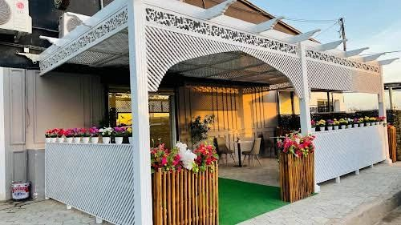

<MO-DJIB CONSULTING>
<html lang="fr">
<head>
    <meta charset="UTF-8">
    <meta name="viewport" content="width=device-width, initial-scale=1.0">
    <title>Mo-Djib Consulting</title>
    <link rel="stylesheet" href="https://stackpath.bootstrapcdn.com/bootstrap/4.5.2/css/bootstrap.min.css">
    <link rel="stylesheet" href="https://cdnjs.cloudflare.com/ajax/libs/font-awesome/5.15.4/css/all.min.css">
    
</head>
<body>

<!-- Navbar -->
<nav class="navbar navbar-expand-lg navbar-light">
    

        <a class="navbar-brand" href="#">Mo-Djib Consulting</a>
        <button class="navbar-toggler" type="button" data-toggle="collapse" data-target="#navbarSupportedContent" aria-controls="navbarSupportedContent" aria-expanded="false" aria-label="Toggle navigation">
            
        </button>

        

            <ul class="navbar-nav ml-auto">
                <li class="nav-item">
                    <a class="nav-link" href="#">ACCUEIL</a>
                </li>
                <li class="nav-item">
                    <a class="nav-link" href="#">FORMATIONS</a>
                </li>
                <li class="nav-item">
                    <a class="nav-link" href="#">AUDIT</a>
                </li>
                <li class="nav-item">
                    <a class="nav-link" href="#">ACCOMPAGNEMENT</a>
                </li>
                <li class="nav-item">
                    <a class="nav-link" href="#">E-PACK HYGIÈNE</a>
                </li>
                <li class="nav-item">
                    <a class="nav-link" href="#">ACTUALITÉS</a>
                </li>
                <li class="nav-item">
                    <a class="nav-link" href="#">CONTACTEZ-NOUS</a>
                </li>
            </ul>
        

    

</nav>

<!-- Grande image -->
<section class="big-image">
    
</section>

<!-- Titre Bienvenue -->
<section class="welcome-message section">
    

        

            

                <h1 class="gold-text">Bienvenue chez Mo-Djib Consulting</h1>
                
Votre partenaire mondial pour la qualité, l'hygiène et la sécurité alimentaire

            

        

    

</section>

<!-- Section avec texte et image -->
<section class="about-section section">
    

        

            

                

                    <h2>Plus de 1 ans d’expériences</h2>
                    
Votre expert en qualité, hygiène et sécurité des aliments

                    
MO-DJIB CONSULTING est un cabinet de conseil, d’audit et de formation dans le domaine de la qualité, l’hygiène et la sécurité des denrées alimentaires. Notre équipe vous accompagne : porteurs de projets et chefs d’entreprise quelque soit votre type d’activité : du snack à l’industrie agro-alimentaire, en passant par la restauration commerciale, collective, la distribution et les métiers de bouche (boulangerie, patisserie, boucherie, charcuterie,..)

                

            

            

                
            

        

    

</section>

<!-- Section Nos Services -->
<section class="our-services section">
    

        

            

                

                    <h2>Nos Services</h2>
                    
Nous sommes à votre écoute

                

            

            

                

                    

                        

                            <i class="icon fas fa-chalkboard-teacher"></i>
                            <h3>Former</h3>
                        

                    

                    

                        

                            <i class="icon fas fa-clipboard-check"></i>
                            <h3>Auditer</h3>
                        

                    

                    

                        

                            <i class="icon fas fa-handshake"></i>
                            <h3>Accompagner</h3>
                        

                    

                

            

        

    

</section>

<!-- Section Qui sommes-nous -->
<section class="who-we-are section">
    

        

            

                

                    <h2>Qui sommes-nous ?</h2>
                    
MO-DJIB CONSULTING, les experts dont vous avez besoin

                    
Notre expérience professionnelle nous permet de vous apporter les meilleurs conseils et expertises en sécurité alimentaire quelque soit votre projet ou votre activité.

                    <ul>
                        <li>Maîtrise de la réglementation en vigueur</li>
                        <li>Mise en place des process</li>
                        <li>Accompagnement des équipes</li>
                    </ul>
                

            

            

                
            

        

    

</section>

<!-- Section Notre Pack Hygiène -->
<section class="pack-hygiene section">
    

        

            

                

                    <h2>Notre Pack Hygiène</h2>
                    
Inspection d'hygiène, formation HACCP, audit et accompagnement

                

            

        

    

</section>

<!-- Section Nos Services -->
<section class="our-services section">
    

        

            

                

                    <h3>Formations</h3>
                    
MO-DJIB CONSULTING vous propose des formations en hygiène alimentaire spécifiques selon le type d’activité; restauration commerciale, collective, petite enfance, …une formation bonnes pratiques d’hygiène, et des formations HACCP et ISO22000 destinées aux industries agro-alimentaires.

                

            

            

                

                    <h3>Audits</h3>
                    
Dans le cadre du système de vérification du plan HACCP, le Cabinet MO-DJIB CONSULTING peut vous accompagner sur l’année grâce à des audits réguliers ou de façon ponctuelle avec suivi des actions correctives incluant le suivi des analyses bactériologiques. Faites nous confiance afin d’être prêt en cas de visite par les services officiels de l’état. En fonction de vos objectifs, notre équipe d’experts vous accompagne. Contactez-nous !

                

            

            

                

                    <h3>Accompagnement</h3>
                    
Bonnes Pratiques d’Hygiène, Plan HACCP, traçabilité et Gestion des produits non conformes… Comptez sur nous pour vous accompagner pour votre dossier plan de maîtrise sanitaire, ou dossier d’agrément sanitaire, votre SMSDA ou votre DUERP. Nous pouvons également vous proposer une solution numérique pour la digitalisation de vos auto-contrôles réglementaires avec sondes connectées.

                

            

        

    

</section>

<!-- Section Contactez-nous -->
<section class="contact-us section">
    

        

            

                

                    <h2>Contactez-nous</h2>
                    
Vous souhaitez en savoir plus sur nos services ou discuter de vos besoins spécifiques en matière de qualité, d'hygiène et de sécurité alimentaire ? N'hésitez pas à nous contacter dès aujourd'hui. Notre équipe est là pour répondre à toutes vos questions et vous aider à atteindre vos objectifs. Chez Mo-Djib Consulting, votre succès est notre priorité.

                    
© 2024 Mo-Djib Consulting. Tous droits réservés.

                

            

        

    

</section>

<!-- Bootstrap Scripts -->

</body>
</html>
